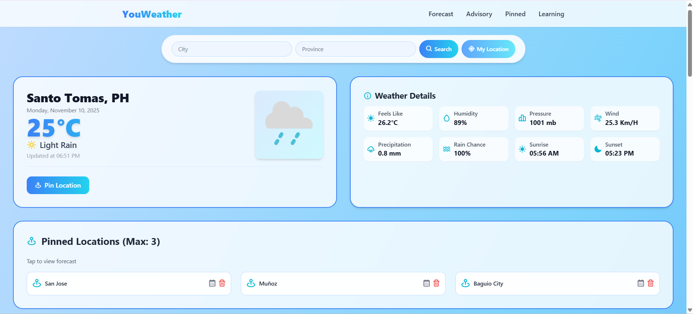

# YouWeather

A modern web app that provides **weather forecasts** and **agricultural advisories** to help farmers and enthusiasts make informed decisions. Built with **Vite**, **Vanilla JavaScript**, and **OpenWeatherMap API**.

---

## Features

- 🌍 Search weather by **city** and **province** in the Philippines  
- 📍 Use **current location** to get local weather  
- 🌡️ Display **temperature, humidity, wind, pressure, precipitation, and sunrise/sunset**  
- 📅 7-day weather forecast  
- ⏱️ Hourly weather forecast  
- 📌 **Pin favorite locations** (max 3)  
- 🌾 Agricultural **farming advisory tips** based on weather conditions  
- 📚 Educational guide on weather parameters (pressure, humidity, rain, wind, etc.)

---

## Screenshots

  
  

---

## Technologies Used

- **Vite** - Frontend build tool  
- **Vanilla JavaScript** - Interactive functionality  
- **CSS / Glassmorphism** - Modern UI design  
- **BoxIcons** - Icons  
- **OpenWeatherMap API** - Weather data  

---

## Installation

1. Clone
2. Go to Directory
3. npm install
4. create env and put API KEY
   - VITE_JOKE_KEY=your_api_key_here
5. npm run dev

---

## Usage

1. Open the app in your browser (usually `http://localhost:5173`)  
2. Search for a city (and optionally province)  
3. Click **My Location** to get local weather  
4. View **hourly** and **weekly forecasts**  
5. Pin your favorite locations for quick access  

---

## Acknowledgements

- [OpenWeatherMap API](https://openweathermap.org/api) for weather data  
- [BoxIcons](https://boxicons.com/) for icons  
- [Vite](https://vitejs.dev/) for build tooling  
- Inspired by modern weather and agricultural apps  
- This is supposed for Youmanitarian International Organizational Website. But for some reasons...

---

## Author

**Je-ric** – [GitHub Profile](https://github.com/Je-ric)
